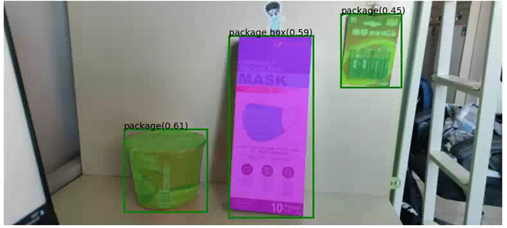
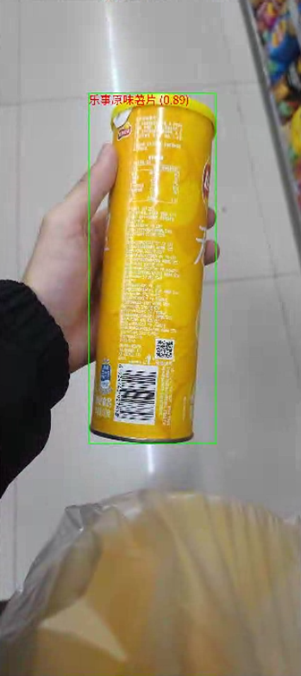
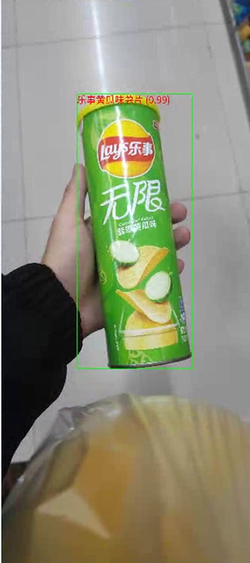
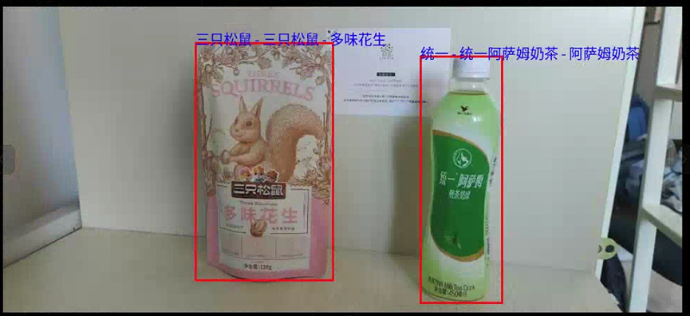
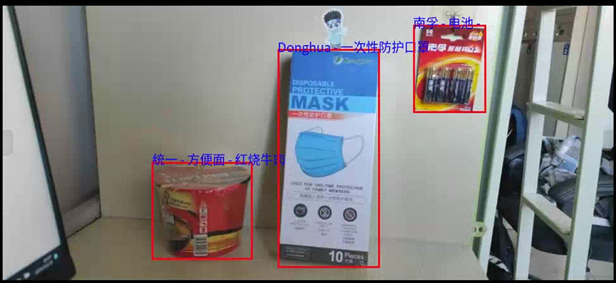
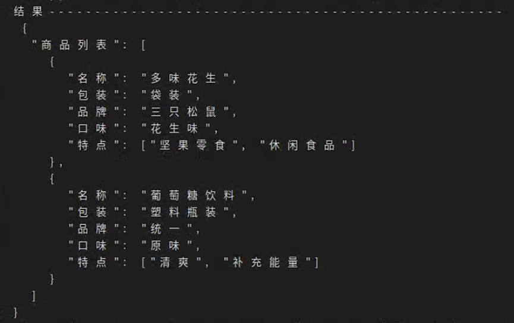

# GSAM_CLIP_Claude

**描述**：  
基于GSAM（Grounded Segment Anything Model）、CLIP和Claude大模型的物体检测与细粒度分类项目。

**写在前面**：  
本项目的测试和调用文件为`test.py`、`test_gsam_claude.py`和`test_gsam_clip.py`，分别实现了通过大模型和CLIP模型的物体检测与分类。具体使用方法详解“4. 使用说明”。

---

## 1. 项目简介

本项目结合了GSAM的目标检测与分割能力，以及CLIP和Claude大模型的跨模态理解与分类能力，能够在复杂场景下实现物体的精准定位与属性提取。通过对目标物体的检测、分割和细粒度分类，项目特别适用于商品分类、智能货柜管理等任务。

---

## 2. 项目结构

```plaintext
GSAM_CLIP_Claude
│
├── GroundingDINO/                     # Grounding DINO 模型相关文件
├── huggingface/                       # 大模型相关依赖
├── outputs/                           # 输出结果目录
├── segment_anything/                  # SAM 模型相关文件
│
├── test_GroundedSAM.py                # GSAM 封装实现
├── test_gsam_claude.py                # GSAM+Claude 大模型调用脚本
├── test_gsam_clip.py                  # GSAM+CLIP 细粒度分类脚本
├── test.py                            # 主测试脚本
│
├── requirements.txt                   # 项目依赖文件
├── README.md                          # 项目说明文件
└── assets/                            # 示例测试数据
    ├── test/                          # 测试图片目录
```

### 关键文件介绍

- **`test_GroundedSAM.py`**：GSAM模型封装类，提供物体检测、分割、裁剪等功能。  
- **`test_gsam_claude.py`**：集成GSAM与Claude大模型，通过文本提示生成目标物体的详细描述。  
- **`test_gsam_clip.py`**：集成GSAM与CLIP模型，完成物体的细粒度分类任务。  
- **`test.py`**：主调用脚本，结合Claude API完成目标检测、分类与可视化。  

---

## 3. 环境与依赖

### 依赖环境

- Python version: 3.10.15
- PyTorch version: 1.12.1
- CUDA version: 11.3
- Open-CLIP


### 安装依赖

项目的所有依赖项已列在`requirements.txt`中，可通过以下命令安装：

```bash
pip install -r requirements.txt
```

---

## 4. 使用说明

### 4.1 GSAM封装测试

运行`test_GroundedSAM.py`，可以测试GSAM模型的物体检测与分割功能，并保存分割后的结果：

```bash
python test_GroundedSAM.py
```

### 4.2 GSAM+Claude

运行`test_gsam_claude.py`，调用GSAM进行物体检测并结合Claude大模型生成目标物体的详细描述：

```bash
python test_gsam_claude.py
```

### 4.3 GSAM+CLIP

运行`test_gsam_clip.py`，测试GSAM与CLIP的结合，通过细粒度分类实现目标物体的品牌和属性识别：

```bash
python test_gsam_clip.py
```

### 4.4 主流程测试

运行`test.py`，结合GSAM和Claude大模型完成目标物体的检测、分类，并在原图上可视化检测结果：

```bash
python test.py
```

---

## 5. 示例结果

以下是项目运行的示例结果：

GSAM测试实例：



GSAM+CLIP测试实例：





GSAM+Claude测试实例：





### 图像检测结果

检测结果展示了目标物体的分类信息、品牌和口味等细节，并在原图上绘制了边界框和标签。

### 分类结果的JSON输出



---

## 6. 数据准备

### 数据预处理

如需在其他数据集上测试，需将数据裁剪为目标区域，并按需标注属性信息。可参考`test_GroundedSAM.py`中`merge_cropped_boxes`方法完成裁剪操作。

---

## 7. 未来工作

1. 优化大模型调用的速度和效率，适配实时检测场景。  
2. 探索结合多模态信息（如视频流和深度信息）的物体分类方案。  

---

以上是GSAM_CLIP_Claude项目的说明文档，如有疑问或改进建议，欢迎讨论！

